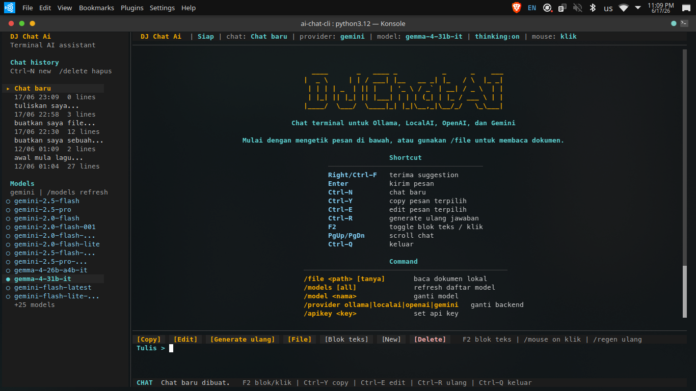
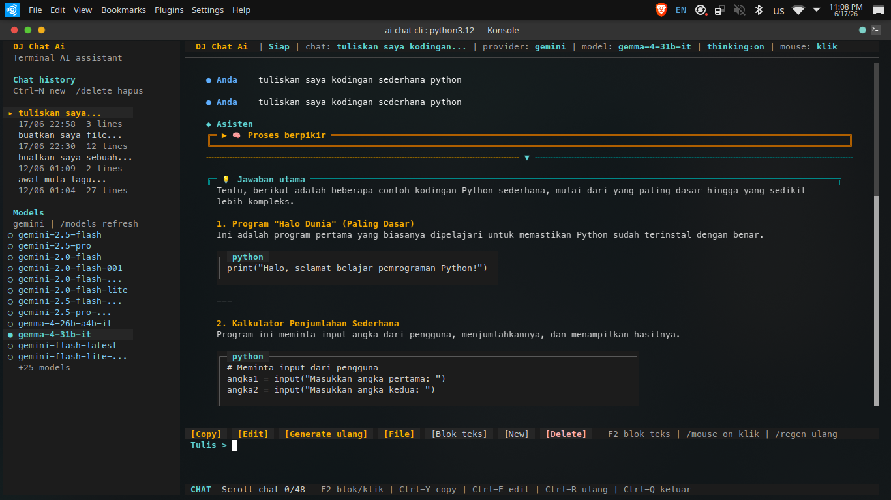

# DJ Chat Ai




Chat AI di terminal dengan tampilan antarmuka interaktif (Rich & Prompt-Toolkit), mendukung **Gemini**, **OpenAI**, **DeepSeek**, **Ollama**, dan **LocalAI**.

## Fitur Utama

- **UI Terminal Modern:** Dilengkapi header status, sidebar (history/model), toolbar aksi interaktif, serta kemampuan copy/edit dengan klik mouse.
- **Proses Berpikir (Thinking) Otomatis:** Menampilkan proses alur berpikir (reasoning) model dengan fitur *collapse/expand* yang rapi.
- **Smart Markdown Labeling:** Mendeteksi isi kotak markdown secara otomatis (misal: otomatis melabeli kotak sebagai "lirik" jika mendeteksi teks lagu).
- **Konteks Dokumen (RAG Lokal):** Baca file lokal (`.txt`, `.pdf`, `.docx`, gambar OCR) untuk dijadikan konteks obrolan lewat perintah `/file`.
- **Ganti Model On-the-fly:** Ubah provider atau model langsung di dalam chat tanpa perlu *restart* (`/provider`, `/model`).
- **Penyimpanan Otomatis:** Riwayat chat (`~/.config/ai-chat-cli/sessions`) dan konfigurasi tersimpan permanen; judul chat dapat diganti dari tombol **Rename Chat** atau perintah `/rename`.
- **Folder Project:** Kelompokkan chat berdasarkan tema atau pekerjaan. Project dan chat tampil bertingkat di sidebar, seperti folder project pada ChatGPT.
- **Monitor Resource Real-time:** Status bar menampilkan penggunaan CPU dan RAM proses aplikasi, diperbarui setiap detik selama TUI berjalan.
- **Statistik Token:** Setiap jawaban menampilkan token masuk, token keluar, dan total token; tanda `~` berarti angka estimasi karena provider tidak mengirim metadata usage.

## Instalasi

### Prasyarat

- Python 3.10 atau lebih baru
- `python3-venv` untuk membuat virtualenv
- Salah satu backend AI:
  - **Ollama** berjalan di `http://127.0.0.1:11434` (untuk model lokal, termasuk DeepSeek lokal)
  - **LocalAI** berjalan di `http://127.0.0.1:8080`
  - **OpenAI/Gemini/DeepSeek** dengan API key

Di Ubuntu/Debian:

```bash
sudo apt update
sudo apt install python3 python3-venv python3-pip
```

### Instalasi cepat

```bash
# Masuk ke folder project
cd ~/ai-chat-cli

# Buat venv dengan Python 3 sistem (disarankan)
./setup-venv.sh
source .venv/bin/activate

# Jalankan aplikasi
./aichat
```

Script `setup-venv.sh` akan membuat ulang `.venv`, memasang dependency utama,
dan memasang package project dalam mode editable.

### Instalasi via .deb package (Debian/Ubuntu)

Cara paling mudah untuk menginstall di sistem Debian/Ubuntu — tidak perlu setup venv manual.

#### Dari release

Download file `.deb` dari halaman [Releases](https://github.com/djrecycle/ai-chat-cli/releases), lalu install:

```bash
sudo dpkg -i aichat_1.3.0_all.deb
```

Repo ini sekarang juga punya workflow GitHub Actions yang akan build dan
upload file `.deb` otomatis saat tag didorong ke GitHub atau saat release
dipublish.
Workflow ini mengunggah dua asset: paket standar dan varian `-docs` yang
menyertakan dependency fitur dokumen.

Perbedaan asset release:

- `aichat_<versi>_all.deb`
  Paket standar untuk chat terminal utama.
- `aichat_<versi>_all-docs.deb`
  Paket standar + dependency fitur dokumen seperti PDF, DOCX, dan OCR gambar.
- Catatan OCR
  Varian `-docs` tetap lebih optimal jika `tesseract-ocr` terpasang di sistem.

Setelah terinstall, langsung jalankan:

```bash
aichat
```

#### Build .deb sendiri dari source

```bash
git clone https://github.com/djrecycle/ai-chat-cli.git
cd ai-chat-cli

# Build package (butuh python3 & pip3)
chmod +x build-deb.sh
./build-deb.sh

# Install hasil build
sudo dpkg -i dist/aichat_1.3.0_all.deb
```

Untuk menyertakan fitur dokumen (Pillow, pypdf, pytesseract, python-docx):

```bash
./build-deb.sh --docs
```

#### Uninstall

```bash
sudo dpkg -r aichat          # hapus package
sudo dpkg -P aichat          # hapus package + konfigurasi
```

### Instalasi manual

Gunakan cara ini jika ingin mengontrol langkah instalasi sendiri:

```bash
cd ~/ai-chat-cli
python3 -m venv .venv
source .venv/bin/activate

python -m pip install --upgrade pip
pip install -r requirements.txt
pip install -e .

aichat --help
aichat
```

> **Penting:** Jangan buat venv dari terminal Cursor IDE — bisa ikut memakai Python AppImage Cursor dan venv jadi rusak (`source .venv/bin/activate` gagal / `./aichat` crash). Gunakan terminal biasa di laptop Anda.

### Instalasi fitur dokumen

Untuk membaca PDF, DOCX, dan gambar OCR lewat `/file`, install dependency opsional:

```bash
source .venv/bin/activate
pip install ".[documents]"
```

Jika muncul error `This environment is externally managed`, berarti `pip` sedang
dijalankan ke Python sistem. Aktifkan `.venv` dulu atau panggil pip dari venv:

```bash
.venv/bin/python -m pip install ".[documents]"
```

Untuk OCR gambar, install Tesseract di sistem:

```bash
sudo apt install tesseract-ocr tesseract-ocr-ind
```

### Menjalankan aplikasi

Jika venv sudah aktif:

```bash
aichat
```

Tanpa mengaktifkan venv:

```bash
./aichat
```

Atau langsung via modul Python:

```bash
.venv/bin/python -m chat_cli
```

### Update setelah ada perubahan kode

Jika dependency tidak berubah, cukup jalankan lagi aplikasinya. Jika dependency
berubah atau venv rusak:

```bash
./setup-venv.sh
source .venv/bin/activate
```

### Error pip `JSONDecodeError` / PyPI timeout

Jika `pip install` gagal parse JSON dari `pypi.org`, itu masalah koneksi ke PyPI (bukan bug project). Solusi:

```bash
# Opsi 1 — pakai script setup (sudah ada fallback mirror + paket apt)
./setup-venv.sh

# Opsi 2 — mirror manual
source .venv/bin/activate
pip install --no-cache-dir \
  -i https://mirrors.aliyun.com/pypi/simple/ \
  --trusted-host mirrors.aliyun.com \
  -r requirements.txt
pip install -e .

# Opsi 3 — paket Ubuntu (offline-friendly)
sudo apt install python3-venv python3-click python3-rich python3-prompt-toolkit
python3 -m venv --system-site-packages .venv
source .venv/bin/activate
pip install --no-deps --no-build-isolation -e .
```

## Tutorial Singkat Penggunaan

Berikut adalah cara memanfaatkan beberapa fitur unggulan DJ Chat Ai:

### 1. Fitur "Proses Berpikir" (Reasoning)
Saat menggunakan model yang mendukung proses berpikir (seperti `gemini-2.5-flash-thinking` atau model *reasoning* Ollama), terminal akan menampilkan blok khusus bernama **🧠 Proses berpikir**.
- Secara bawaan, blok ini akan disembunyikan (*collapsed*) agar chat terlihat rapi.
- Jika Anda ingin membaca proses berpikir model, pastikan mode mouse menyala (`F2`), lalu klik judul **▶ 🧠 Proses berpikir** untuk membukanya (*expand*).
- Anda dapat menyalakan/mematikan fitur ini menggunakan perintah `/thinking on` atau `/thinking off` langsung di kolom input.

### 2. Berinteraksi dengan Mouse
Aplikasi ini sudah sepenuhnya mendukung kontrol *Mouse* di terminal!
- **Klik Kiri** pada daftar obrolan di sisi kiri (Sidebar) untuk berpindah riwayat obrolan secara instan.
- **Klik Kiri** pada model di sisi kiri untuk mengganti model yang sedang aktif secara instan.
- **F2**: Menyalakan mode "Blok teks" jika Anda ingin menyeleksi (mem-blok) teks dengan mouse untuk di-copy ke luar terminal.

### 3. Smart Code Block & LaTeX
Aplikasi secara cerdas mem-parsing hasil teks model Anda:
- Format matematika LaTeX seperti tanda panah (`$\rightarrow$`) akan diubah langsung menjadi simbol rapi (`→`).
- Kotak (blok) hasil generasi AI akan secara dinamis diberi nama. Contohnya, jika Anda meminta AI membuat lagu, kotaknya tidak lagi bernama "code", tapi otomatis menyesuaikan menjadi **"lirik"**.

## Daftar Perintah Bawaan

```bash
# Default (Ollama) — mode chat interaktif
aichat

# Bantuan & versi
aichat --help
aichat --version

# Opsi global (Click)
aichat --model qwen2.5:1.5b --provider ollama
aichat -m qwen2.5:1.5b -p ollama -t 0.8

# Subcommand
aichat ask "Apa itu Python?"
aichat ask --file ./README.md "Ringkas dokumen ini"
aichat models
aichat status
aichat config
aichat config --save

# Atau via modul Python
python -m chat_cli
python -m chat_cli ask "Halo"
```

### Perintah dalam chat

Saat mengetik di input chat, aplikasi akan memberi suggestion abu-abu untuk
command seperti `/file`, `/provider`, `/model`, serta prompt dari riwayat.
Tekan tombol panah kanan atau `Ctrl-F` untuk menerima suggestion.

| Perintah | Keterangan |
|----------|------------|
| `/file <path> [pertanyaan]` | Baca file teks, DOCX, PDF, atau gambar OCR |
| `/file` | Buka file browser CLI, lalu ringkas file yang dipilih |
| `/file --browse [pertanyaan]` | Buka file browser CLI dengan instruksi khusus |
| `/help` | Bantuan |
| `/new` | Buat sesi chat baru |
| `/delete` | Hapus sesi chat aktif |
| `/rename <judul>` | Ganti judul sesi chat aktif |
| `/project` | Lihat project aktif dan daftar project |
| `/project new <nama>` | Buat folder project dan chat baru di dalamnya |
| `/project <nama>` | Buka project yang sudah ada |
| `/project move <nama>` | Pindahkan chat aktif ke project tertentu |
| `/project rename <nama>` | Ganti nama project aktif beserta seluruh chat di dalamnya |
| `/project delete confirm` | Hapus project aktif beserta seluruh chat di dalamnya |
| `/models` | Daftar model |
| `/models all` | Tampilkan semua model ke layar chat |
| `/model <nama>` | Ganti model |
| `/provider ollama\|localai\|openai\|gemini\|deepseek` | Ganti backend |
| `/apikey <key>` | Simpan API key untuk provider aktif |
| `/clear` | Hapus riwayat |
| `/regen` | Generate ulang jawaban terakhir/terpilih |
| `/stop` | Hentikan jawaban AI yang sedang diproses (TUI: tombol **[■]** atau `Esc`) |
| `/mouse on\|off` | Ganti mode klik atau blok teks di TUI |
| `/system` | Lihat system prompt aktif |
| `/system <teks>` | Ubah system prompt aktif |
| `/system reset` | Kembalikan system prompt ke default |
| `/thinking on\|off` | Tampilkan/sembunyikan proses berpikir |
| `/status` | Cek koneksi |
| `/save` | Simpan config |
| `/exit` | Keluar |

Saat `/thinking on`, alur berpikir ditampilkan dalam blok visual terpisah
berlabel `Proses berpikir`, sedangkan respons final tampil sebagai `Jawaban utama`.

Untuk mengecek prompt internal yang sedang dipakai, jalankan `/system`.
Untuk mengubahnya, gunakan `/system <teks baru>`, lalu `/save` jika ingin
perubahan itu tersimpan untuk sesi berikutnya.

`/new`, `/delete`, `/rename`, `/project`, `/regen`, dan `/mouse` tersedia di TUI full-screen yang
menjadi mode default saat menjalankan `aichat`.

### Mengelompokkan chat dengan Project

Klik ikon **＋** di sidebar atau ikon **▣** di toolbar, ketik nama project, lalu tekan
Enter. Chat baru berikutnya otomatis dibuat di dalam project aktif. Folder project dapat diklik
di sidebar untuk membuka chat terakhir di dalamnya. Klik folder yang sudah terbuka sekali lagi
untuk collapse/menyembunyikan daftar chat; klik kembali untuk expand.

```text
/project new Website Toko
/project new Belajar Python
/project Website Toko
/project move Belajar Python
/project rename Belajar Python Lanjutan
/project delete confirm
```

Chat lama yang belum memiliki project otomatis ditampilkan dalam folder **Umum**. Data project
disimpan di `~/.config/ai-chat-cli/projects.json`, sedangkan isi chat tetap berada di folder
`~/.config/ai-chat-cli/sessions`. Project aktif juga dapat diganti namanya atau dihapus melalui
ikon **✎** dan **×** di bawah daftar project pada sidebar. Penghapusan baru dijalankan setelah
mengetik `confirm`, dan akan menghapus seluruh chat di dalam Project tersebut. Folder **Umum**
dilindungi sehingga tidak dapat diganti namanya atau dihapus.

Contoh membaca file di mode chat:

```text
/file ./README.md ringkas isi dokumen ini
/file ./laporan.docx ambil poin penting
/file ./kontrak.pdf jelaskan risiko utama
/file ./nota-belanja.jpg baca teks pada gambar
/file "~/Documents/catatan rapat.txt" buatkan poin keputusan
/file
/file --browse jelaskan poin penting dan risiko utamanya
```

Di file browser TUI, folder dan file dapat langsung diklik. Klik folder untuk membukanya;
klik file untuk memuatnya ke chat dan langsung meminta jawaban AI. Keyboard tetap dapat dipakai:
ketik nomor untuk masuk folder atau memilih file, `..` untuk naik folder, `/teks` untuk filter
nama file, `/` untuk menghapus filter, dan `q` untuk batal.

File teks seperti `.txt`, `.md`, `.py`, `.json`, `.csv`, dan log bisa dibaca langsung.
Untuk DOCX, PDF, dan gambar, install paket opsional seperti di bagian
**Instalasi fitur dokumen**:

```bash
pip install ".[documents]"
```

Untuk membaca gambar (`.png`, `.jpg`, `.jpeg`, `.webp`, `.tif`, `.tiff`, `.bmp`, `.gif`),
install aplikasi OCR Tesseract di sistem:

```bash
sudo apt install tesseract-ocr tesseract-ocr-ind
```

> [!IMPORTANT]
> Dukungan gambar asli saat ini hanya tersedia pada provider **Gemini** dan **Ollama**.
> Provider OpenAI, DeepSeek, dan LocalAI pada aplikasi ini belum menerima gambar asli; gambar
> diproses melalui Tesseract OCR dan hanya teks hasil ekstraksinya yang dikirim ke model.

Gemini dan Ollama mengirim gambar langsung sebagai input multimodal sehingga model vision dapat
memahami objek, diagram, warna, tata letak, dan teks dalam gambar. Pastikan model yang dipilih memang
mendukung input atau output gambar.

| Provider | Kegunaan | Contoh model yang didukung |
|---|---|---|
| Gemini | Memahami gambar | `gemini-3.5-flash`, `gemini-3-flash-preview`, `gemini-2.5-flash`, `gemini-2.5-pro`, `gemma-4-26b-a4b-it`, `gemma-4-31b-it` |
| Gemini | Generate dan edit gambar | `gemini-3.1-flash-lite-image`, `gemini-3.1-flash-image`, `gemini-3-pro-image`, `gemini-2.5-flash-image` |
| Ollama | Memahami gambar secara lokal | `granite3.2-vision:2b`, `qwen2.5vl:3b`, `gemma3:4b`, `gemma3:12b`, `gemma3:27b`, `llama3.2-vision:11b` |
| Ollama | Generate gambar | Belum didukung oleh integrasi aplikasi ini |

Daftar tersebut merupakan contoh model yang diketahui mendukung gambar, bukan daftar lengkap.
Ketersediaan model Gemini bergantung pada API key dan region. Model Ollama harus diunduh terlebih
dahulu dan ukuran model perlu disesuaikan dengan RAM/CPU/GPU komputer.

Contoh memahami gambar:

```text
/file ./foto-studio.jpg jelaskan semua yang terlihat pada gambar ini
/file ./diagram.png jelaskan alur diagram ini secara bertahap
```

Ukuran gambar maksimum untuk upload langsung adalah 15 MB. Untuk laptop dengan RAM 8 GB tanpa GPU
diskrit, gunakan `granite3.2-vision:2b`; `qwen2.5vl:3b` dan `gemma3:4b` membutuhkan lebih banyak RAM
dan biasanya lebih lambat.

### Generate dan edit gambar

Pilih provider Gemini dan model image, lalu tulis prompt seperti pesan chat biasa. Model yang
direkomendasikan adalah `gemini-3.1-flash-image`; gunakan `gemini-3-pro-image` untuk pekerjaan
visual profesional yang lebih kompleks.

```text
/model gemini-3.1-flash-image
Buat ilustrasi studio musik futuristik dengan pencahayaan neon, rasio 16:9
```

Gambar yang dihasilkan disimpan otomatis ke `~/Pictures/DJ-Chat-AI/`, kemudian lokasi file
ditampilkan pada jawaban chat. Untuk mengedit gambar, pilih gambar melalui tombol **[File]** saat
model image aktif, lalu sertakan instruksi perubahan, misalnya "ubah latar menjadi matahari terbenam".

Catatan: PDF hasil scan biasanya tidak punya teks tertanam. Ubah halaman PDF scan menjadi gambar,
lalu baca dengan `/file gambar.png ...`, atau jalankan OCR PDF di luar aplikasi terlebih dahulu.

## Konfigurasi

Edit `~/.config/ai-chat-cli/config.json`:

```json
{
  "provider": "ollama",
  "ollama": {
    "base_url": "http://127.0.0.1:11434",
    "model": "qwen2.5:1.5b"
  },
  "deepseek": {
    "base_url": "https://api.deepseek.com",
    "model": "deepseek-chat",
    "api_key": ""
  },
  "localai": {
    "base_url": "http://127.0.0.1:8080",
    "model": "gpt-3.5-turbo",
    "api_key": ""
  },
  "system_prompt": "Kamu adalah asisten AI yang ramah...",
  "temperature": 0.7,
  "show_thinking": true
}
```

Environment:

```bash
export AI_CHAT_PROVIDER=localai
```

## Prasyarat

- **Ollama**: `ollama serve` (biasanya sudah jalan) + model (`ollama pull qwen2.5:1.5b`)
- **LocalAI**: server di `http://127.0.0.1:8080` dengan endpoint OpenAI-compatible
